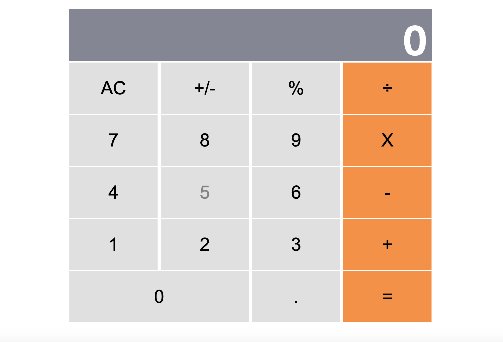

# React Calculator


<p align="center">
    
</p>


Simple calculator made with react.js. This project consisted to build a calculator using create-react-app And deploy it to herroku. 

### You can test the live version of the app here:
https://react-calculator-c.herokuapp.com/


### Tech used:

* react js
* Big.js
* prop-types
* Css


## Using the app in development 
Clone this repo (you need Node js installed in your computer).
```
$ git clone git@github.com:certilremy/react-calculator.git
```

Change to the app directory 
 
 ```
$ cd react-calculator
 ```

   And run 

```
$ npm install 
```

To run the app

```
$ npm start
```


To build for production

```
$ npm run build
```

To run the tests

```
$ npm run test
```

## Authors

* Certil Remy    Github : https://github.com/certilremy

## Contribution 

If you want to contribute to this project you're welcome .
Follow the github code of conduct fork this repo and open your pull request. 
